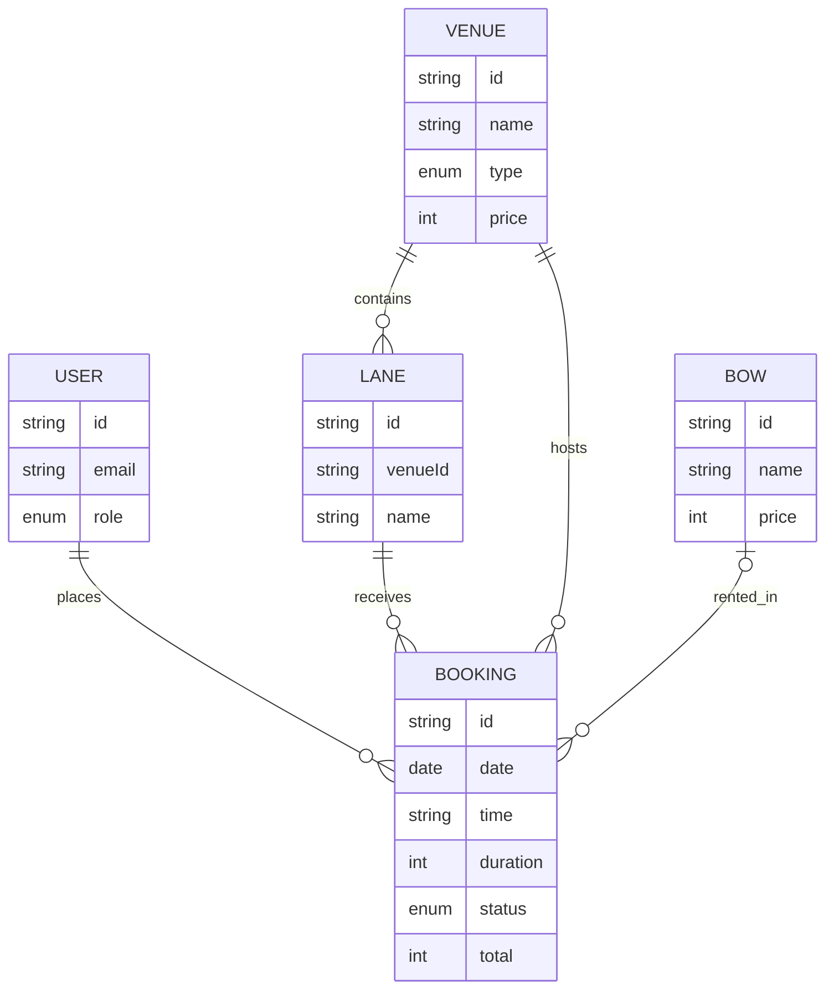

# C'Archery API

REST API untuk C'Archery Booking Management System.

## Tech stack
- Node.js + Express
- JWT authentication, bcrypt password hashing, CORS
- Prisma schema PostgreSQL tersedia di `prisma/schema.prisma` sebagai kontrak database deployment

## Run locally
```bash
npm install
npm run dev
```
Server berjalan di `http://localhost:4000`.

Seeded accounts: `alya@carchery.id` / `password` (USER) dan `admin@carchery.id` / `password` (ADMIN).

## Endpoint list
| Method | Endpoint | Auth | Description |
|---|---|---|---|
| GET | `/api/health` | No | Health check |
| GET | `/api/venues` | No | Indoor/outdoor range dan 5 lane |
| GET | `/api/bows` | No | Daftar rental bow dan harga |
| GET | `/api/weather` | No | Kondisi cuaca outdoor |
| GET | `/api/availability?venueId=&date=` | No | Lane reserved dan tersedia |
| POST | `/api/auth/register` | No | Register member |
| POST | `/api/auth/login` | No | Login dan JWT token |
| GET | `/api/me` | JWT | Current user |
| GET | `/api/bookings` | JWT | Booking user / semua booking admin |
| POST | `/api/bookings` | JWT | Buat booking baru |
| PATCH | `/api/bookings/:id/cancel` | JWT | Batalkan booking |
| DELETE | `/api/bookings/:id` | Admin JWT | Hapus booking |
| POST/PATCH/DELETE | `/api/bows[/:id]` | Admin JWT | CRUD rental bows |
| POST/PATCH/DELETE | `/api/venues[/:id]` | Admin JWT | CRUD ranges/lapangan |
| PATCH | `/api/bookings/:id` | JWT | Reschedule booking |

### Booking request
```json
{"venueId":"outdoor","laneId":"O2","date":"2026-09-24","time":"16:00","duration":2,"bowId":"recurve","bringOwnBow":false}
```

## Database diagram
ERD source ada di `prisma/schema.prisma`. Jalankan `npm run db:generate` setelah `DATABASE_URL` tersedia untuk deployment PostgreSQL, lalu `npm run db:push` pada database baru.



## Security and persistence
Passwords are hashed with bcrypt, JWT routes reject missing or invalid bearer tokens, and admin mutations require the `admin` role. With `DATABASE_URL`, Prisma connects to PostgreSQL on startup and reports its state through `/api/health`; local development without a database uses an explicit memory fallback.

## Deployment
Deploy ke Render/Railway dengan build command `npm install && npm run db:generate`, start command `npm start`, dan environment variables `DATABASE_URL`, `JWT_SECRET`, serta `NODE_VERSION=20`. Template Render tersedia di `render.yaml`. Frontend memakai URL deployment melalui `VITE_API_URL`.

Deployment links:
- Frontend: `https://carchery-web.vercel.app` (replace with actual URL)
- Backend: `https://carchery-api.onrender.com` (replace with actual URL)
